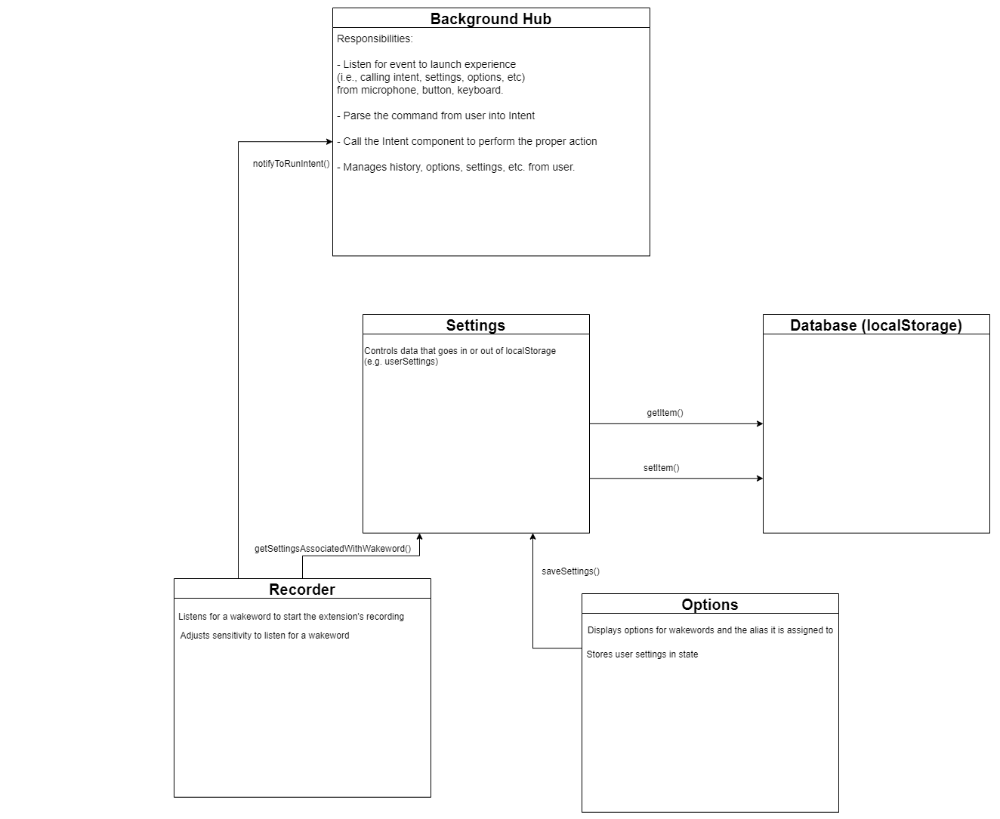

# Deliverable 3 Firefox Voice Feature Analysis

## Selected issues

### [Issue 1237](https://github.com/mozilla/firefox-voice/issues/1237)

#### Description:
Currently, when using the Firefox Voice extension, there does not exist an internal tool to view a user's history of commands. This issue attempts to address the issue by by saving the user's history in an IndexedDB database. This will be achieved by saving the user's commands that are inputted to the extension. This issue requires a substantial architectural change since all other parts of the repo that store data use localStorage instead of IndexedDB. This will also create the framework of the history feature for future issues such as creating an UI for the user to view history elegantly.

#### Files to be changed/added:

1. `extension/background/intentRunner.js` - This file that lives within the background hub, is responsible for beginning the execution of voice/text commands from the user. Since this is the entry point for the commands, modifying the `runIntent()` function which calls the `addIntentHistory()` function will allow for adding the command to the DB whether it is successful or fails.

2. `extension/history.js` - (NEW) This file will have to be created which will contain functions that are responsible for communicating with the history DB within IndexedDB. This will include various queries such as adding, getting and updating which we can call via the `intentRunner.js` script.

#### Architectural Change:
To demonstrate the change that will occur with the implementation of this issue, we have decided to modify the existing sequence diagram from deliverable 1 that detailed the process of a user saying a command into the extension. In the highlighted area, we have shown the additional components and functions that will be executed as a result of this change. Once receiving the command from the user, the intent runner will utilize the history database API which adds the entry of the command to the database. Observe that before this change, there was no major interaction with a database in this sequence.


Note: The sequence diagrams for the additional database methods (get, update) will be very similar to the highlighted area in the above sequence diagram.


#### Reasons for selecting this issue:

We selected ["Save history #1237"](https://github.com/mozilla/firefox-voice/issues/1237) to implement for this deliverable because it is a ***substantial but manageable*** feature for the Firefox-Voice project. Originally, this project stores users' voice command history in an array as a temporary measure.
But the current design is not ideal, as users' voice command history is erased each time users terminate or restart the Firefox Voice process.
Therefore, the project owner wants to migrate the data to IndexedDB, a somewhat persistent storage such that the history data could be retrieved and display to the users on the browser in the future.

It is a substantial feature to implement because:
1. it will be a brand new feature in the project,
2. it requires us to understand the flow of **intents** in the project (more carefully and in more detail) so we can make design and architectural decisions on
how it should interact with IndexedDB,
3. it requires us to fully understand the IndexedDB API's, and
4. it requires us to write code that is compatible with the exisiting code-base.

In addition, considering how active the Firefox-Voice project is, there will likely be additional requirements for managing user data (e.g., store other data besides history)
in the near future. As such, we need to make our IndexedDB framework as generic as possible while catering to the current needs of the project. Thus, we believe this is a substantial issue for our team.

Moreover, this is also a managebale task for all of us as this issue involves more closely with the **backend** code, which we all have experiecne from courses such as CSCB07,
CSCB09, CSCC09, CSCC01 and our unique co-op experiences.

All in all, we believe contributing to this issue will have a great impact on the project as a whole. It will be a fun and challening experience for all of us!

#### Implementation Plans

- We will create a file called `history.js` under the "extension" folder. In the `history.js` file, we will develop an indexedDB framework for this project to create a data table and manage their data. Therefore, we will implement a class called Database with the following methods:
    1. `createTable(tbName, primaryKey, version)`

        a. Create a new table with a table name and specify the primary key and version for the table

    2. `get(tbName, primaryKey)`

        a. Return an entry from a specific table using primary key

    3. `getAll(tbName, sortingDirection)`

        a. Return all entries from a specific table in an order that user requested

        b. If the user did not specify a sorting order, the default order would be descending or most recent first when the primary key is timestamp.

        c. For example, when a user wants to check all their voice command history, this method will be called.

    4. `add(tbName, obj)`

        a. Add an object entry to a specific table

        b. For example, this method will be called every time automatically when a user uses the firefox voice extension by either typing or saying their command

    5. `delete(tbName, primaryKey)`

        a. Delete an entry from a specific table based on its primary key

        b. For example, this method will be called when a user wants to delete a specific voice command history from the database

    6. `clearAll(tbName)`

        a. Delete all the content of the table (i.e when users want to clear all their voice command history)

- In `background/intentRunner.js` file, we will create a table to store all the user’s voice command. Under the `addIntentHistory()` method, we will add the command history entry to the table we created on the same file.

#### Acceptance test

##### Unit testing for IndexedDB example
```js
test("compiler", () => {
  expect(
    compile(
      "(bring me | take me | go | navigate | show me | open) (to | find |) (page |) [query]"
    ).toString()
  ).toBe(
    'FullPhrase("(bring me | take me | go | navigate | show me | open) (to | find | ) (page | ) [query:+]")'
  );
});
```
If existing tests pass, the IndexedDb does not break any functionality.
End-to-end test can demonstrate if IndexedDb behaves as desired.

##### End-to-end testing
1. Install Firefox Nightly

2. Clone the repo and run `npm install` and `npm start` in the project root directory

3. Paste the following into the address bar: `about:devtools-toolbox?type=extension&id=firefox-voice%40mozilla.org`

4. On the left bar, select the following to see the past voice command history `Indexed db -> moz-extension -> voice(default) -> utterance`

6. Use the voice extension by typing or speaking an action

7. Go back to the inspection tab in step 4, to find the voice command in IndexedDB

### [Issue 1118](https://github.com/mozilla/firefox-voice/issues/1118)

**Description**: This issue involves adding support to alias wakewords to start the recorder and perform an action.

Currently, the extension has support for a number of wakewords (similar to "Hey Google" or "Hey Siri"). If enabled, when a user says one of the supported wakewords, the extension is triggered and it begins recording the user's voice to pass as an intent.

This issue would enable users to assign an action to a wakeword. This would allow a wakeword to trigger the extension and also pass an action to the extension to perform as an intent. For example, saying "blueberry" could be aliased to starting the extension and performing a "Play \<artist>\<song> on Spotify".

#### Designs of implementation

To implement this feature, we will need to add a UI component to `optionsView.jsx` so the user can configure wakewords with actions. For example, the user can type out an action to be performed and assign it to a wakeword, by placing it next to the wakeword.

Then, we would have to update the user's settings in the database/`localStorage` so that the new wakeword is persistent (`optionsView.jsx`) across restarts.

On detection of the keyword in `wakeword.js`, we need to get the corresponding action from `localStorage` and notify the background script (`main.js`) that an intent has to be run and pass the intent data (i.e. the action to perform).



#### Architecture (Revisted)

After our issue investigations (in particular, issue 1237) for Deliverable 3, we realized the **database** is an important component that should be added to our original architectural model to make our UML more complete. With the new addition of the database component we made the following changes to our UML diagram:

1. We seperated the **settings** responsibilty from the `Background Hub` into its own component as we realized the `setting.js` is a more stand-alone piece of code
that solely handles the responsibilty of managing the user settings and make two-way communications between the `User Settings Views` and the database.
2. We generalized the `Onboarding` component into the `User Settings View` together with `Options`, as this is where users have access to manage their settings.
3. We added an arrow from the `Background Hub` to the Database component as that's the place where voice command history is saved.

With the newly polished UML diagram, we can see that the Database, `User Settings Views`, and `Settings` can be considered an instance of the Model-View-Controller (MVC) model.
Where, the database holds the current information about user settings, thus the "model"; the `User Settings Views` component is where the user is able to see and make changes
to their settings, thus the "view"; and lastly, the `Settings` component acts as the controller that either retrieves information for the view or is in charge of making
changes to the database, thus the "controller".


