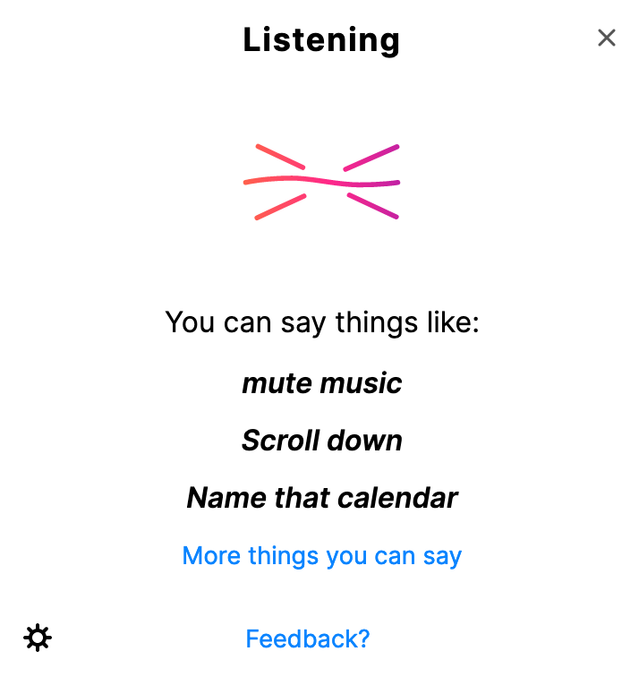
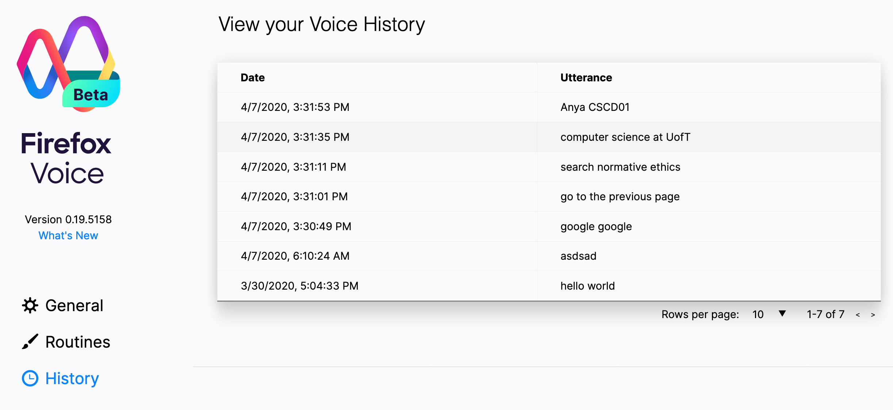

# Deliverable 4: Firefox Voice History Viewer

Trello Link: https://trello.com/b/HhP4hl03/deliverable-4

Our feature comprises of two issues, the [architecture (#1237)](https://github.com/mozilla/firefox-voice/issues/1237) that supports the functionality to view the history and the [user interface (#1359)](https://github.com/mozilla/firefox-voice/issues/1359) that visualizes the data.

## Firefox Voice History User Guide

This feature intends to enable the Firefox-Voice extension to
keep track of user's command history to the extension.

Users can now find a **new** tab under the settings page called
`history` that allows them to view all previous voice commands.

Same as always, Firefox-Voice will process user commands
through the listener pop-up window.
The users can then visit the `history` tab by first clicking
the gear icon followed by the history icon.

  

The history tab shows the Voice History table
which shows the corresponding phrase ordered by most recent time.

## Firefox Voice History Documentation

 We created a file called history.js under the "extension" folder. In the history.js file, we developed an indexedDB framework for this project to create a data table and manage their data. Therefore, we implemented a class called Database with the following methods:

 - `createTable(tbName, primaryKey, version)`
    - **Description**: create a new table with a table name and specify the primary key and version for the table
     -   **Parameters**:
	     -  `tbName`:
		     - Type: String
		     - Description: the name of the table that the user is going to create
	     - `primaryKey`:
		     - Type: String
		     - Description: the primary key of the table
	     - `version`:
		     -  Type: Integer
		     -  Description: the version number of the table
     - **Return**:
	     - Returns a promise

 - `get(dbName, tbName, primaryKey)`
    - **Description**: get a specific entry of the table based on the given primary key
     -   **Parameters**:
	     -  `dbName`:
		     - Type: String
		     - Description: the name of the table that the user is going to create
	     - 	 `tbName`:
		     - Type: String
		     - Description: the name of the table that the user is going to create
	     - `primaryKey`:
		     - Type: String
		     - Description: the primary key of the table
     - **Return**:
	     - Returns an entry from a specific table based on the given primary key

 - `getAll(dbName, tbName, sortingDirection)`
    - **Description**: get all entries from a specific table in an order that user requested
     -   **Parameters**:
	     -  `dbName`:
		     - Type: String
		     - Description: the name of the table that the user is going to create
	     - 	 `tbName`:
		     - Type: String
		     - Description: the name of the table that the user is going to create
	     - `sortingDirection`:
		     - Type: String
		     - Description: "prev" is most recent first (based on * primaryKey), "next" is the most recent last (based on primaryKey). If the user did not specify a sorting order, the default order would be descending or most recent first when the primary key is timestamp.
     - **Return**:
	     - all entries from a specific table in an order that user requested

 - `add(tbName, obj)`
    - **Description**: Add an object entry to a specific table. For example, this method will be called every time automatically when a user uses the firefox voice extension by either typing or saying their command
     -   **Parameters**:
	     - 	 `tbName`:
		     - Type: String
		     - Description: the name of the table that the user is going to create
	     - `obj`:
		     - Type: Object
		     - Description: an object that we are going to insert into the table. The attribute name of this object should correspond to the table column name, and the value of the attribute will be the value under that column name in table
     - **Return**:
	     - Returns a promise

 - `delete(dbName, tbName, primaryKey)`
    - **Description**: Delete an entry from a specific table based on its primary key. For example, this method will be called when a user wants to delete a specific voice command history from the database
     -   **Parameters**:
	     -  `dbName`:
		     - Type: String
		     - Description: the name of the table that the user is going to create
	     - 	 `tbName`:
		     - Type: String
		     - Description: the name of the table that the user is going to create
	     - `primaryKey`:
		     - Type: String
		     - Description: the primary key of the table
     - **Return**:
	     - Returns a promise

 - `clearAll(dbName, tbName)`
    - **Description**: Delete all the content of the table (i.e when users want to clear all their voice command history)
     -   **Parameters**:
	     -  `dbName`:
		     - Type: String
		     - Description: the name of the table that the user is going to create
	     - 	 `tbName`:
		     - Type: String
		     - Description: the name of the table that the user is going to create
     - **Return**:
	     - Returns a promise

In background/intentRunner.js file, we created a table to store all the user’s voice command. Under the addIntentHistory() method, we added the command history entry to the table we created on the same file.

In comparison with the planning, there are a few changes in the actual implementation. First, we made some methods static in order to access them more easily without creating a new object every time we want to access data in a table. These methods are `get()`, `getAll()`, `delete()`, `clearAll()`. Second, we changed the signatures of the methods that we mentioned in the first point. Since those methods are static now, we need to pass into one more argument to indicate the database name when we use those methods.

__History UI__

The interface for viewing voice history is integrated into the options page (in `optionsView.jsx`) by adding it as a separate tab. Once that tab is navigated to, it loads the main `History` component (in `historyView.jsx`) which encapsulates the history data retrieval. The `History` component retrieves the data from the `IndexedDB` and passes it all to the `HistoryTable` component (in `historyView.jsx`) which manipulates the data. It also keeps track of changes to the data and re-fetches it if it has been modified. This way, the `HistoryTable` component only handles the presentation of data and logic of user interaction with the table which are closely tied togehter. This allows the components to follow the single responsibility principle.

The `HistoryTable` component contains the logic of the user interaction such as pagination of data, the number of entries they wish to see and clearing the history.

## Acceptance Tests

The package `fake-indexeddb` needs to be installed to test the indexed db.
It is used to demonstrate the newly implementedthe api works.

##### End-to-end testing for adding history
1. Install Firefox Nightly

2. Clone the repo and run `npm install` and `npm start` in the project root directory

3. Paste the following into the address bar: `about:devtools-toolbox?type=extension&id=firefox-voice%40mozilla.org`

4. On the left bar, select the following to see the past voice command history `Indexed db -> moz-extension -> voice(default) -> utterance`

6. Use the voice extension by typing or speaking an action

7. Go back to the inspection tab in step 4, to find the voice command in IndexedDB

Besides this, the new feature to delete a history entry can also be checked
##### End-to-end testing for deleting history

1. Issue a few commands in the browser

2. Paste the following into the address bar: `about:devtools-toolbox?type=extension&id=firefox-voice%40mozilla.org` to see the commands issued.

3. User can either delete one entry or all entries.

4. Changes are reflected in the history tab.

## Unit Tests

Due to the nature of using a history database with `IndexedDB`, we would need to find a way to mock the database within the scope of the unit tests. To do this we used an external dependency `fake-indexeddb` which would provide an in-memory implementation of `IndexedDB` which normally existed within the browser. This would allow us to test all functions of our history database API. Addtionally, Firefox Voice uses `Jest` in some areas to test various important features. So, we decided to also use `Jest` as it provides a simplistic and intuitive way to compare results.

The tests can be found [here](https://github.com/mozilla/firefox-voice/blob/3452672848bf55f96f91966679d05813daefdd03/extension/options/history/history.test.js). Running the tests within the repo can be performed by using `npm run jest` which will run all jest test files.

The approach we took to ensure that all API methods were working correctly was to create a test database and perform a series of the available methods while using `Jest` to check the intended results.

## Software Development Process

The first step we took to tackle this deliverable was to create and assign new cards on the `To Do` section of our Trello board by having a group meeting and deciding who would be working on what. The items that we distributed during this meeting included implementation for history database API, implementation for history UI and creation of the unit tests. After this point, the group would informally meet online every 3 days to address any concerns that other group members may have had.

Because implementation correctness is so crucial as we are contributing to an open source project, we decided that all group members must individually review the implementation of any work that was done. This means that once a group member has completed a task, they must move the card from `Doing` to `Review` and assign all other group members on the Trello board. This involved reviewing and commenting on the PR for each implementation card.

The Kanban software development process allowed flexibility and agility in our team. Each of us responsibly pulled tickets on our 
`Trello` board, solving problems by focusing on bottlenecks and 
ensuring a smooth flow through the traffic our tickets.
When we were implementing the Firefox-Voice History issue,
we first broke down the issue into its two major components 
--- the API and the UI. We strategically broke down the task into smaller, more manageable pieces such that each piece can be dealt 
with by one or two members on the team. Tasks were pulled following 
our `Discord` discussions and the development, testing, reviewing of 
the issues were done according to plan. At all times, we are able to
**visually** monitor the jobs assigned to each individual and the 
bottleneck of our workflow. Working with Kanban helped us enormously 
with our planning, execution, and adjustments to the requirements of the ticket.
