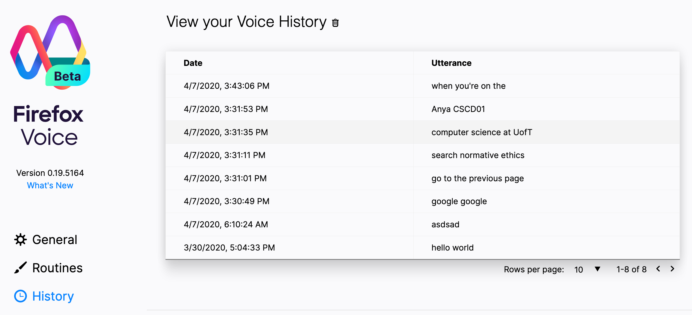

# Deliverable 4: Firefox Voice History Viewer

Trello Link: https://trello.com/b/HhP4hl03/deliverable-4

Our feature comprises of two issues, the [architecture (#1237)](https://github.com/mozilla/firefox-voice/issues/1237) that supports the functionality to view the history and the [user interface (#1359)](https://github.com/mozilla/firefox-voice/issues/1359) that visualizes the data.

## Firefox Voice History User Guide

This feature intends to enable the Firefox-Voice extension to 
keep track of user's command history to the extension. 

Users can now find a **new** tab under the settings page called 
`history` that allows them to view all previous voice commands.

Same as always, Firefox-Voice will process user commands
through the listener pop-up window.
The users can then visit the `history` tab by first clicking 
the gear icon followed by the history icon. 

  

The history tab shows the Voice History table 
which shows the corresponding phrase ordered by most recent time.

## Firefox Voice History Documentation

WIP

## Acceptance Tests

WIP
